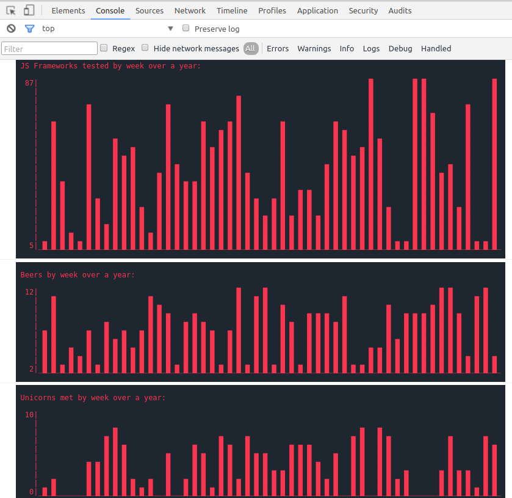

# console.chart

Display data as chart bars in your browser console  



```html
<script src="https://rawcdn.git.rest/MAKIO135/console.chart/ed9d560d8dea6c6a308c1800f876967c45eab2f7/console.chart.min.js"></script>
```

Usage:

    console.chart( array [ , params ] );

Parameters:

    title: String, optional, default: none
    height: Number, optional, default: 10
    color: String, optional, default: 'black'
    background: String, optional, default: none
    min: Number, optional, default: min( data )
    max: Number, optional, default: max( data )

Examples:  

    console.chart( [ 5, 6, 10 ] );

    // utility function to create random arrays of n integers between min and max
    function randData( n, min, max){
      return [].map.call( new Array( n ).fill( 0 ), d => ~~ ( min + Math.random() * ( max - min ) ) );
    }

    console.chart( randData( 52, 0, 12 ), {
      title: 'Commits by week over a year:'
    } );

    console.chart( randData( 52, 1, 17 ), {
      color: 'rgb( 251, 53, 80 )',
      background: 'rgb( 30, 38, 48 )',
    } );

    console.chart( randData( 52, 0, 6 ), {
      title: 'Beers by week over a year:',
      color: 'rgb( 251, 53, 80 )',
      background: 'rgb( 30, 38, 48 )',
      height: 10,
      min: 0,
      max: 10
    } );
